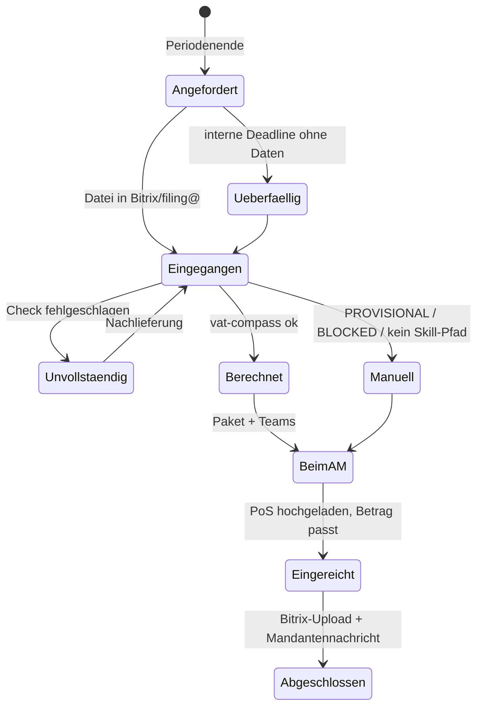
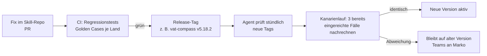
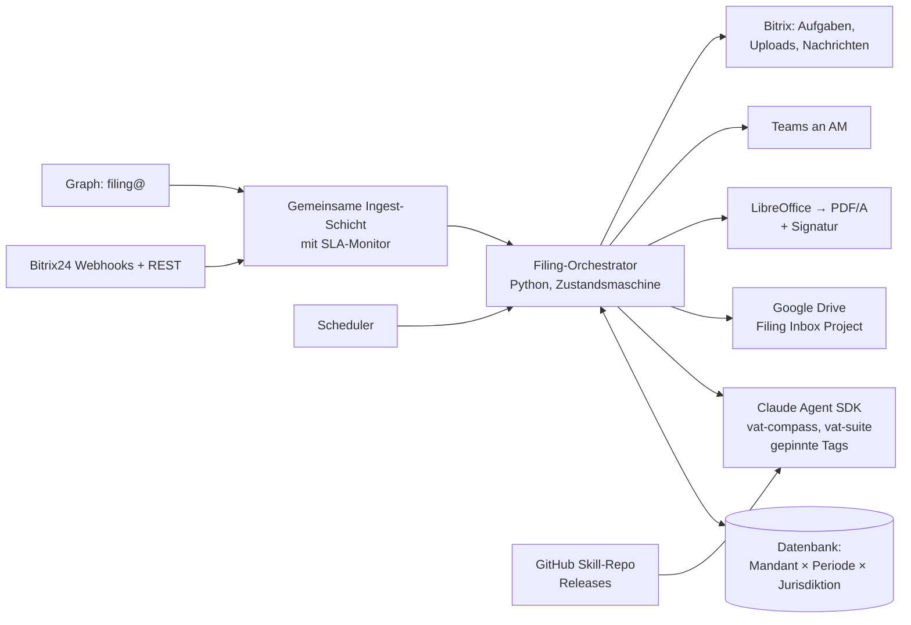

# Filing-Agent – Projektplan

**Ziel:** Ein Agent begleitet jeden Berichtszeitraum weitgehend autonom: Er fordert Transaktionsdaten an, erkennt den Eingang in Bitrix oder filing@, legt die Daten in Google Drive ab, rechnet alle fälligen Voranmeldungen mit `vat-compass`, erzeugt die Zahlungsinformationen mit `singularity-vat-suite` als PDF und informiert den Account Manager. Nach Einreichung und Upload des Proof of Submission (PoS) stellt er alles in das Bitrix-Projekt des Mandanten und schreibt dem Mandanten.

Stand: 08.10.2026 · Status: Entwurf, Entscheidungen 4 und 5 getroffen, Rest offen (Abschnitt 8)

---

## 0. Befunde aus den Skills (08.10.2026)

Vor dem Plan ein Blick in die Skills, die der Agent nutzen soll (`vat-compass` v5.18.1, `singularity-vat-suite` v4.2.0). Diese Befunde bestimmen das Design stärker als die Wunschliste.

| # | Befund | Konsequenz für das Design |
|---|--------|---------------------------|
| 1 | **Der Bitrix-Webhook-Token steht im Klartext in den Skills** (`SKILL.md` und `client_master_mapping.md`, 9 Fundstellen). Ein Inbound-Webhook in Bitrix ist ein Vollzugriff mit den Rechten von User 8. | **Vor** dem Umzug der Skills nach GitHub: Token rotieren, aus den Skills entfernen, nur noch über eine Umgebungsvariable bzw. den Schlüsselbund. Sonst liegt der CRM-Zugang im Git-Verlauf, auch nach dem Löschen. |
| 2 | Beide Skills sind für den **Chat** gebaut: „deliver all files as downloads in the chat“, `PAYMENT_HANDOFF` als JSON-Block im Chat-Text, Rückfragen an den Nutzer („Ask if unclear“ bei BE/AT/HU/RO). | Für den Autonombetrieb braucht es einen **Headless-Modus**: feste Ausgabeordner, `PAYMENT_HANDOFF` als Datei, statt Rückfragen ein Status `NEEDS_HUMAN` mit Grund. Das ist eine Änderung an den Skills, nicht am Agenten. |
| 3 | `singularity-vat-suite` erzeugt **.docx**, nicht PDF. | PDF-Konvertierung (LibreOffice headless) als fester Schritt im Agenten. Zum „nicht manipulierbar“ siehe 3.5: Ein PDF allein ist das nicht. |
| 4 | Zahlungsschreiben gibt es nur für **DE, FR, IT, ES, PL, CZ, UK**. Für NL, SE, BE, AT, HU, RO gibt es keine Upload-Datei und keinen `PAYMENT_HANDOFF`. FR état récapitulatif wird nicht erzeugt. Erstattungen und Nullmeldungen bekommen kein Schreiben. | Diese Fälle laufen **planmäßig** in die manuelle Spur. Der Agent erledigt die Datensammlung und die Benachrichtigung, aber nicht das Schreiben. |
| 5 | Offene Punkte laut Skill: PL-Portfolio nicht geprüft, keine PL-Regression, AT/BE/HU-Bitrix-Felder unverifiziert, IT/ES Deemed-Reseller `PROVISIONAL`. | Diese Konstellationen gehen bis zur Klärung **immer** an einen Menschen. Kein Autopilot auf ungeprüftem Pfad. |
| 6 | **Bug im Skill:** Das Code-Beispiel in `client_master_mapping.md` mappt `"NL"` auf `UF_CRM_1759947953056`, laut Feldtabelle derselben Datei ist das das **IE**-Feld. `"GB"` zeigt auf das Mischfeld, das laut Tabelle nicht als Länderfeld genutzt werden darf. | Belegt, dass Skills Fehler enthalten. Genau deshalb darf „immer die neueste Version“ nicht ungeprüft in die Produktion laufen (siehe 3.6). |
| 7 | Abgaberhythmus in Bitrix: Felder für DE, FR, IT, ES, NL, CZ, AT, BE, SE, HU, RO. **Kein Feld für PL und UK.** UK-Quartale hängen an der Stagger-Gruppe des Mandanten, nicht am Kalenderquartal. | Für Funktion 6 (Anschreiben zu Periodenbeginn) fehlt die Datengrundlage für UK. Bitrix-Feld „UK VAT Stagger“ anlegen und befüllen, bevor UK-Mandanten automatisch angeschrieben werden. |
| 8 | Der Skill kennt schon die Infrastruktur: filing@ (Graph), Shared Drive „Filing Inbox Project“, Teams-Kanal „AVTR Received | SV Filing“ (Power Automate). | Darauf aufsetzen statt neu bauen. |

---

## 1. Kritische Punkte vorab

1. **„Immer die aktuelle Skill-Version aus GitHub“ ist in der Form ein Risiko, keine Absicherung.** Ein Commit mit Fehler auf `main` rechnet beim nächsten Lauf unbemerkt für alle Mandanten falsch, ohne dass jemand zuschaut. Das Ziel (Bugfixes schnell in Produktion) ist richtig, der Weg muss sein: Releases mit Versions-Tag, ein Regressionstest gegen echte, bereits eingereichte Fälle als Freigabe-Gate, und jeder Lauf protokolliert die verwendete Skill-Version. Details in 3.6.
2. **Die Reihenfolge in Funktion 4/5 hat eine Lücke.** Die Zahlungsinformation entsteht **vor** der Einreichung. Korrigiert der Account Manager bei der Einreichung einen Wert (ELSTER-Fehler, Nachbuchung, Rundung), passt das Schreiben nicht mehr zur Erklärung. Deshalb: Vor der Freigabe an den Mandanten vergleicht der Agent den Zahlbetrag im Schreiben mit dem Betrag im PoS. Weicht er ab, geht nichts an den Mandanten, und das Schreiben wird neu erzeugt.
3. **„Mandant hat Daten bereitgestellt“ heißt nicht „Daten sind vollständig“.** Häufige Fälle: nur ein Marktplatz, nur zwei von drei Monaten (IT braucht das volle Quartal), falscher Zeitraum, TCR statt AVTR. Ein Agent, der auf unvollständigen Daten rechnet, produziert eine plausibel aussehende falsche Erklärung. Ein **Vollständigkeits-Check** vor der Berechnung ist Pflicht (3.2).
4. **Die Eingangsbestätigung darf nichts versprechen.** „Wir haben Ihre Daten erhalten und prüfen sie“ ist richtig, „Ihre Daten sind vollständig, wir reichen ein“ ist es erst nach dem Check.
5. **Überschneidung mit dem Inbox-SLA-Monitor.** Beide lesen filing@ und Bitrix-Projekte. Zwei Systeme, die unabhängig in denselben Postfächern lesen und schreiben, erzeugen doppelte Nachrichten und widersprüchliche Status. Die Bestätigungen des Filing-Agenten sind Auto-Nachrichten und dürfen die SLA-Uhr **nicht** stoppen. Gemeinsame Ingest-Schicht, siehe 4.
6. **Berufsrecht.** Die Erklärung bleibt Arbeit des Steuerberaters, der Agent bereitet vor. Mandantennachrichten mit Steuerbeträgen gehen erst nach dem PoS-Gate raus, also nach menschlicher Einreichung. Daten an ein LLM: AV-Vertrag und ZDR nach § 203 StGB / § 62a StBerG, wie beim SLA-Monitor.
7. **„Zu Beginn eines jeden Berichtszeitraums“ heißt fachlich: nach dessen Ende.** Für Oktober kann der Mandant erst ab 1. November liefern. Der Agent schreibt also am Anfang des Folgemonats und orientiert sich an der Abgabefrist des Mandanten (inkl. Dauerfristverlängerung DE), nicht am Kalender allein.

---

## 2. Gesamtablauf

```mermaid
flowchart TD
    subgraph P[Periodenstart: 1. Werktag nach Periodenende]
        P1[Bitrix: aktive Mandanten,<br/>Registrierungen, Abgaberhythmus] --> P2{Welche Perioden<br/>enden jetzt?}
        P2 --> P3[Anforderung an Mandant<br/>im Bitrix-Projekt + Mail]
        P3 --> P4[Erinnerungen T-10, T-5, T-2<br/>vor interner Deadline]
    end

    subgraph E[Eingang]
        E1[Bitrix: Datei im Projekt<br/>Outbound-Webhook]
        E2[filing@: Mail mit Anhang<br/>Graph Change Notification]
    end
    E1 & E2 --> F[Zuordnen: Mandant, Periode<br/>über Projekt / Absender / VAT-ID in der Datei]
    F --> G[Ablage Google Drive<br/>/Mandant/Jahr/Periode/01_Eingang]
    G --> H[Eingangsbestätigung an Mandant<br/>„erhalten, wird geprüft“]
    H --> I{Vollständigkeits-Check}
    I -->|unvollständig| I1[Konkrete Nachforderung<br/>„es fehlt: Amazon.it, September“]
    I1 --> E
    I -->|vollständig| J[vat-compass headless<br/>alle Jurisdiktionen der Periode]

    J --> K{QA-Status je Jurisdiktion}
    K -->|FINAL_UPLOAD_READY| L[singularity-vat-suite<br/>Zahlungsinfo EN .docx → PDF]
    K -->|PROVISIONAL / BLOCKED| M[Manuelle Spur:<br/>Teams an AM mit Grund]
    K -->|kein Handoff: NL/SE/BE/AT/HU/RO,<br/>Erstattung, Null| M

    L --> N[Ablage Drive /02_Berechnung, /03_Zahlung]
    N --> O[Teams an zuständigen AM:<br/>Paket bereit + Links + Frist]
    M --> O

    O --> Q[AM reicht ein, lädt PoS hoch<br/>Bitrix-Aufgabe der Periode]
    Q --> R{PoS-Check:<br/>Betrag PoS = Betrag Zahlungsinfo?}
    R -->|Abweichung| L
    R -->|ok| S[Upload ins Bitrix-Projekt:<br/>PoS + Zahlungsinfo PDF]
    S --> T[Mandantennachricht EN:<br/>eingereicht, Betrag, Fälligkeit]
    T --> U[Periode abgeschlossen]
```

### Status je Mandant und Periode



Der Status lebt an **einer** Stelle: eine Bitrix-Aufgabe pro Mandant, Periode und Jurisdiktion (z. B. „UStVA DE 2026-10“) im Mandantenprojekt. Das ist für den AM sichtbar, ohne neues Tool, und der PoS-Upload an dieser Aufgabe ist das Signal für den Agenten.

---

## 3. Bausteine im Detail

### 3.1 Funktion 6 – Anforderung zu Periodenbeginn

- Täglicher Lauf: Für jeden aktiven Mandanten aus Bitrix die Registrierungen (`seller_vat_matrix`) und den Abgaberhythmus je Land lesen. Daraus die Perioden ableiten, die gestern geendet haben.
- Eine Nachricht pro Mandant, nicht pro Land: „Bitte laden Sie den Amazon VAT Transaction Report für Oktober 2026 hoch. Er wird für folgende Erklärungen benötigt: DE (monatlich), PL (monatlich), IT (Q4, mit Dezember).“
- Kanal: Beitrag im Bitrix-Projekt des Mandanten (Hauptkanal, dort soll hochgeladen werden), dazu eine Mail als Kopie.
- **Interne Deadline (entschieden): gesetzliche Frist minus 4 Werktage.** Bis dahin müssen die Daten vollständig vorliegen.
- **Folge für das Mandantenfenster:** Bei DE monatlich **ohne** Dauerfristverlängerung (Frist 10. des Folgemonats) bleiben dem Mandanten nach Periodenende nur etwa 2–3 Werktage. Feste Erinnerungen wie „T-10, T-5“ passen da nicht. Die Erinnerungen richten sich deshalb nach der Länge des Fensters: bei ≤ 3 Werktagen eine Erinnerung am Vortag der internen Deadline, sonst zur Fenstermitte und am Vortag. Höchstens drei Erinnerungen.
- Mandanten, bei denen das Fenster regelmäßig nicht reicht, erscheinen im Wochenbericht. Für sie ist eine Dauerfristverlängerung (DE) oder eine frühere Datenlieferung die Lösung, nicht mehr Erinnerungen.
- Ohne Daten bis zur internen Deadline: Teams an den AM. Der Agent macht keine Schätzungen.
- Mandanten mit Status `ARCHIVE`, `ONBOARDING`, `INACTIVE`, `POA Revoked`, `Deregistered` werden **nicht** angeschrieben, sondern im Wochenbericht aufgeführt.

### 3.2 Funktionen 1, 2 und Bestätigung – Eingang, Ablage, Vollständigkeit

**Eingang erkennen**

| Kanal | Mechanik | Zuordnung zum Mandanten |
|-------|----------|-------------------------|
| Bitrix-Projekt | Outbound-Webhook auf neue Dateien/Beiträge im Projekt, dazu stündlich Polling als Netz (`disk.folder.getchildren` bzw. Projekt-Feed) | Projekt → Mandant (eindeutig) |
| filing@ | Graph Change Notification + Delta-Sync (dieselbe App-Registrierung wie der SLA-Monitor) | Absender → Bitrix-Kontakt; bei Unklarheit `TRANSACTION_SELLER_VAT_NUMBER` aus der Datei |

Nur Dateien, die wie Transaktionsdaten aussehen (CSV/TXT/XLSX mit AVTR- oder TCR-Kopfzeile, Singularity-Template mit `Invs Issued`), lösen den Ablauf aus. Andere Anhänge bleiben beim SLA-Monitor.

**Ablage Google Drive (Shared Drive „Filing Inbox Project“)**

```
/<Client-ID> <Name>/<Jahr>/<Periode>/
    01_Eingang/       Originaldateien, unverändert, mit Zeitstempel + SHA-256
    02_Berechnung/    Workpaper, XML, QA_<Periode>.xlsx, payment_handoff.json, run.json
    03_Zahlung/       Zahlungsinfo PDF (+ .docx intern)
    04_Einreichung/   Proof of Submission
```

`run.json` enthält: Skill-Versionen (Tag + Commit), Eingangsdateien mit Hash, Status je Jurisdiktion, Dauer. Das ist der Prüfpfad.

**Eingangsbestätigung (Bitrix-Projekt, EN, kurz):**
> Thank you – we have received your transaction data for October 2026. We're now checking it and will start preparing your VAT returns. You don't need to do anything else for now; we'll be in touch if anything is missing.

**Vollständigkeits-Check (deterministisch, Python, kein LLM)**

- Datumsspanne der Transaktionen deckt die Periode vollständig ab (IT: alle drei Monate des Quartals).
- Jede in Bitrix registrierte Jurisdiktion kommt in den Daten vor **oder** ist als „keine Umsätze“ plausibel (dann Rückfrage, keine stille Nullmeldung).
- Seller-VAT-IDs in der Datei passen zum Mandanten. Fremde VAT-ID = falsche Datei.
- Dateiformat erkannt (AVTR/TCR), Encoding lesbar, keine abgeschnittenen Zeilen.
- Duplikate: dieselbe Datei (Hash) zweimal = ignorieren; neue Datei für dieselbe Periode = neuer Lauf, alter Lauf wird als überholt markiert.

### 3.3 Funktionen 2, 3 – Berechnung mit `vat-compass`

- Laufzeit: **Claude Agent SDK** auf dem Mac mini, `vat-compass` als Skill aus dem gepinnten Release (3.6). Ein Lauf pro Mandant und Periode, alle Jurisdiktionen in einem Lauf (der Skill macht den Länder-Split selbst über `pre_filter.py`).
- Jurisdiktionen und Rhythmus kommen aus Bitrix (der Skill liest sie ohnehin dort). Der Agent übergibt zusätzlich die **erwartete** Liste aus 3.1 und vergleicht sie mit dem, was der Skill tatsächlich berechnet hat. Fehlt eine Jurisdiktion, ist das ein Fehler, keine Nullmeldung.
- Ergebnis wird **nicht** aus dem Chat-Text gelesen, sondern aus Dateien: QA-Workbook (Tabs `XML_Readiness`, `Handoff`, `Scope_Coverage`) und `payment_handoff.json`. Dafür braucht der Skill den Headless-Modus aus Befund 2.
- Weiter in die Automatik geht nur `FINAL_UPLOAD_READY`. Alles andere landet mit Grund in der manuellen Spur.

**Realistische Automatisierungsquote:** DE, CZ, PL, ES, UK, IT (bei vollem Quartal) können bei sauberen Daten durchlaufen. FR wird berechnet, das état récapitulatif bleibt manuell. NL, SE, BE, AT, HU, RO: Workbook automatisch, alles danach manuell. Die tatsächliche Quote misst Phase 1.

### 3.4 Funktion 4 – Zahlungsinformationen

- Input ausschließlich `payment_handoff.json` aus dem Lauf, mit `"language": "EN"`. Kein Betrag aus Freitext. Der Gate in `singularity-vat-suite` (`source_field`, Währung, BUFA) bleibt unverändert und ist erwünscht.
- Ein Schreiben pro zahlbarer Erklärung. `REFUNDABLE` und `NIL` erzeugen kein Schreiben; der AM bekommt den Hinweis.
- Abbrüche der Suite (Mandant nicht in `client_master.csv`, BUFA ohne verifizierte Finanzkasse) gehen an Marko, wie im Skill vorgesehen.

**Widerspruch im Skill:** `singularity-vat-suite` liest Mandantendaten aus `client_master.csv`, `vat-compass` aus Bitrix. Zwei Quellen für dieselbe Adresse und denselben Namen auseinanderlaufen zu lassen, ist ein Fehler mit Ansage. Die Suite sollte die Mandantendaten aus dem Handoff bzw. aus Bitrix übernehmen; die Bankdaten-Tabellen der Finanzkassen bleiben im Skill.

### 3.5 PDF und „nicht manipulierbar“

Ein PDF verhindert keine Manipulation, es macht sie nur unbequemer. Wer den Betrag ändern will, schafft das mit jedem PDF-Editor. Echte Integrität entsteht erst durch eine **Signatur**:

| Stufe | Aufwand | Was sie leistet |
|-------|---------|-----------------|
| PDF/A aus .docx (LibreOffice headless) | gering | Einheitliches, nicht versehentlich veränderbares Format. **Mindeststandard.** |
| + SHA-256 jedes PDFs in `run.json` und im Bitrix-Kommentar | gering | Nachweis im Streitfall, welches Dokument wir verschickt haben |
| + PAdES-Signatur mit Kanzlei-Zertifikat (z. B. `pyHanko`) | mittel (Zertifikat nötig) | Jede Änderung macht die Signatur im PDF-Reader sichtbar ungültig. **Empfehlung** |

### 3.6 Skills aus GitHub – sicher aktuell halten



- **Golden Cases:** je Land 2–3 echte, bereits eingereichte Perioden (anonymisiert oder im privaten Repo) mit den eingereichten Werten als Soll. Ein Release, das einen eingereichten Wert ändert, braucht eine Begründung im Changelog.
- Der Agent zieht **Tags, nie `main`**. Rollback = vorherigen Tag aktivieren.
- Jeder Lauf schreibt die Skill-Version in `run.json`. Wird später ein Bug gefunden, lässt sich sofort sagen, welche Mandanten und Perioden betroffen sind.
- Laufende Perioden wechseln nicht mitten im Ablauf die Version.
- Secrets gehören nicht ins Skill-Repo (Befund 1).

### 3.7 Funktion 5 – Account Manager, PoS, Abschluss

- **Teams an den zuständigen AM** (entschieden: der Projekt-Verantwortliche in Bitrix; ist er abwesend, geht die Nachricht an die Vertretung bzw. an Fiona; fehlt er im Projekt, an Fiona und in den Wochenbericht), eine gebündelte Nachricht pro Mandant und Periode: Jurisdiktionen, Status, Beträge, Frist, Links auf Drive und Bitrix-Aufgabe. Manuelle Fälle mit Grund („PL: Sole-Trader-Daten fehlen in Bitrix“).
- **PoS-Eingang:** Der AM hängt den PoS an die Bitrix-Aufgabe der Periode und schließt sie. Kein anderer Weg (nicht per Mail, nicht per Teams), sonst ist der Eingang nicht verlässlich erkennbar.
- **PoS-Check:** PDF des PoS auslesen (ELSTER-Übertragungsprotokoll, MOJE daně, e-Deklaracje-UPO, AEAT-Justificante usw.), Steuernummer, Periode und Zahlbetrag gegen die Zahlungsinformation prüfen. Bei Abweichung: Schreiben neu erzeugen, AM informieren, nichts an den Mandanten.
- **Abschluss:** PoS und Zahlungsinfo-PDF ins Bitrix-Projekt (Dateien des Projekts, Ordner „VAT Filings / 2026-10“), dann die Mandantennachricht:

> Your VAT returns for October 2026 have been submitted.
>
> - Germany (UStVA): EUR 1,234.56 payable by 10 December 2026
> - Poland (JPK_V7M): PLN 2,100.00 payable by 25 November 2026
>
> Payment instructions and proof of submission are attached in this project. Please use the exact payment reference shown in each document.

Zahlungsziele und Verwendungszwecke kommen aus der Suite, nicht vom LLM formuliert. Die Nachricht ist ein Template mit Feldern, kein freier Text. Die KI darf höchstens den Ton glätten, aber keine Zahlen erzeugen.

---

## 4. Architektur



- **Orchestrator deterministisch, LLM nur in den Skills.** Zustandsübergänge, Fristen, Vollständigkeit, Betragsvergleich und Nachrichtentexte sind normaler Code. Das LLM rechnet (über den Skill) und sonst nichts. So bleibt nachvollziehbar, warum etwas passiert ist.
- **Hosting:** Mac mini, wie beim SLA-Monitor (launchd, Schlüsselbund, FileVault, tägliches Backup, Lebenszeichen werktags 08:00). LibreOffice läuft dort lokal.
- **Idempotenz:** Jeder Schritt prüft vor dem Ausführen, ob er für Mandant, Periode, Jurisdiktion und Dateihash schon gelaufen ist. Ein Neustart des Mac mini darf keine doppelten Mandantennachrichten erzeugen.
- **Gemeinsame Ingest-Schicht mit dem SLA-Monitor:** eine App-Registrierung, eine Bitrix-Anbindung, ein Dedup. Filing-Agent-Nachrichten werden dem SLA-Monitor als „Auto-Nachricht“ gemeldet.

---

## 5. Was automatisch geht und was nicht

| Schritt | Automatisierbar | Begründung |
|---------|-----------------|------------|
| Datenanforderung + Erinnerungen | **voll** | Regelbasiert aus Bitrix. Voraussetzung: Rhythmusfelder gepflegt (PL/UK fehlen) |
| Eingang erkennen, Ablage Drive, Bestätigung | **voll** | |
| Vollständigkeits-Check | **voll**, Nachforderung automatisch | Grenzfälle („keine Umsätze in ES?“) als Rückfrage |
| Berechnung DE, CZ, PL, ES, UK, IT, FR | **weitgehend** | nur bei `FINAL_UPLOAD_READY`; PL bis zur Regression mit AM-Freigabe |
| Berechnung NL, SE, BE, AT, HU, RO | **teilweise** | Workbook ja, Upload-Datei und Zahlungsschreiben nein |
| Zahlungsinformation PDF | **voll** für die 7 Länder der Suite, nur `PAYABLE` | |
| Einreichung | **nein** (bewusst) | bleibt beim AM. Später denkbar: DE über ERiC, PL über e-Deklaracje-API, als eigenes Projekt |
| PoS-Prüfung, Bitrix-Upload, Mandantennachricht | **voll**, nach PoS-Gate | |

Vorsichtige Erwartung für den Start: 50–70 % der Mandantenperioden laufen ohne manuellen Eingriff bis zum AM durch. Der Rest scheitert an Datenqualität in Bitrix, unvollständigen Uploads und den nicht abgedeckten Ländern. Phase 1 liefert die echte Zahl.

---

## 6. Projektphasen

| Phase | Inhalt | Ergebnis | Dauer (grob) |
|-------|--------|----------|--------------|
| **0 – Grundlagen** | Bitrix-Token rotieren und aus Skills entfernen. Skill-Repo auf GitHub neu anlegen (existiert noch nicht), Skills aus claude.ai übernehmen, Release-Tags, Sync zurück nach claude.ai. Headless-Modus in beiden Skills (Dateiausgabe, keine Rückfragen). Golden Cases je Land. Bitrix: Rhythmus PL/UK, UK-Stagger, Aufgaben-Vorlage pro Periode. Drive-Ordnerstruktur. AV-Vertrag LLM (wie SLA-Monitor) | sichere, testbare Skills | 2 Wochen |
| **1 – Schattenlauf** | Eingang erkennen, Ablage, Vollständigkeits-Check, Berechnung, PDF. **Keine** Nachricht an Mandanten oder AM. Ergebnisse gegen die tatsächlich eingereichten Werte des Monats vergleichen | Trefferquote je Land, Liste der Bitrix-Datenlücken | 1 Monatszyklus |
| **2 – AM-Spur** | Teams an AM, Bitrix-Aufgaben, PoS-Check, Upload ins Projekt. Mandantennachricht nur als Entwurf, AM gibt frei | AM arbeitet aus dem Paket heraus | 1 Monatszyklus |
| **3 – Mandantenkommunikation** | Eingangsbestätigung, Nachforderungen und Abschlussnachricht automatisch. Danach die Anforderung zu Periodenbeginn mit Erinnerungen | Mandant sieht den Ablauf | 2 Wochen + 1 Zyklus |
| **4 – Ausbau** | PAdES-Signatur, weitere Länder in der Suite (NL, AT, BE), optional Direkteinreichung DE via ERiC | weniger manuelle Spur | nach Bedarf |

**Bewusste Reihenfolge:** Der erste Monat läuft im Schatten, weil eine falsch berechnete Erklärung teurer ist als ein Monat Verzögerung. Die Anforderung an Mandanten (Funktion 6) kommt zuletzt, obwohl sie am Anfang des Zyklus steht. Sie ist trivial zu bauen, setzt aber saubere Rhythmusdaten in Bitrix voraus. Falsche Anforderungen („bitte liefern Sie für IT“ an einen Mandanten ohne IT-Registrierung) kosten Vertrauen.

---

## 7. Erfolgskriterien

- 100 % der aktiven Mandanten erhalten die Datenanforderung innerhalb von 2 Werktagen nach Periodenende.
- 0 Abweichungen zwischen Zahlungsinformation und PoS beim Mandanten.
- 0 Erklärungen auf unvollständigen Daten berechnet.
- ≥ 60 % der Mandantenperioden ohne manuellen Eingriff bis zum AM (nach Phase 3, Basis Phase 1).
- Zeit von Dateneingang bis Paket beim AM: < 1 Werktag.
- Jede Berechnung ist über `run.json` der Skill-Version und den Eingangsdateien zuordenbar.

---

## 8. Entscheidungen

| # | Frage | Empfehlung |
|---|-------|------------|
| 1 | Gibt es das Skill-Repo auf GitHub schon, und wer darf auf `main` mergen? | **Stand 08.10.2026: Es gibt keins.** Die Skills liegen nur als Organisations-Skills in claude.ai. Empfehlung: neues privates Repo nur für Skills, Merge nur per PR mit grüner Regression. **Eine Quelle der Wahrheit:** Ab dann wird nur noch im Repo geändert, und claude.ai wird aus den Release-Tags aktualisiert. Sonst laufen der Chat-Skill der Mitarbeiter und der Skill des Agenten auseinander, und dieselbe Periode ergibt zwei Ergebnisse. Erster Commit erst **nach** dem Entfernen des Tokens (Befund 1) |
| 2 | Dürfen Golden Cases mit echten Mandantendaten im Repo liegen? | Nein, anonymisieren oder in Drive halten und nur in CI einbinden |
| 3 | PAdES-Signatur ja oder nein? Gibt es ein Kanzlei-Zertifikat? | Ja, sonst ist „nicht manipulierbar“ nicht erfüllt. **Vorhanden (08.10.2026): ELSTER-Zertifikat und spanisches Zertifikat. Beide nicht für die automatische Signatur verwenden:** Mit diesen Schlüsseln werden Erklärungen bei ELSTER bzw. AEAT eingereicht. Liegen sie für die Automatik auf dem Mac mini, kann jeder mit Zugriff auf den Rechner (oder ein Fehler im Agenten) im Namen der Kanzlei einreichen. Außerdem ist das ELSTER-Zertifikat für die Anmeldung bei ELSTER gedacht, nicht für Dokumente, und Adobe zeigt es als „Gültigkeit unbekannt“ an. Empfehlung: eigenes Siegelzertifikat der GmbH (fortgeschrittenes oder qualifiziertes eSiegel, EU-Vertrauensliste) mit Remote-Signatur-API, nur zum Signieren von PDFs. Bis dahin: PDF/A + SHA-256 (Stufe 1–2 in 3.5) |
| 4 | Interne Deadline vor der gesetzlichen Frist? | **Entschieden (08.10.2026): 4 Werktage** vor der gesetzlichen Frist, bei Dauerfristverlängerung entsprechend später. Folge siehe 3.1 |
| 5 | Wer ist der zuständige AM? | **Entschieden (08.10.2026): Projekt-Verantwortlicher in Bitrix.** Lücken im Wochenbericht, Abwesenheit → Vertretung/Fiona |
| 6 | Wie liefern Mandanten ohne Amazon-Daten (eigene Buchhaltung, Singularity-Template)? | Template-Pfad nutzen, aber in Phase 1 gesondert messen |
| 7 | Soll `singularity-vat-suite` Mandantendaten künftig aus Bitrix statt aus `client_master.csv` lesen? | Ja (3.4) |
| 8 | Sprache der Datenanforderung und Bestätigung: immer EN oder nach Mandantensprache in Bitrix? | EN als Standard, DE wenn in Bitrix hinterlegt |
