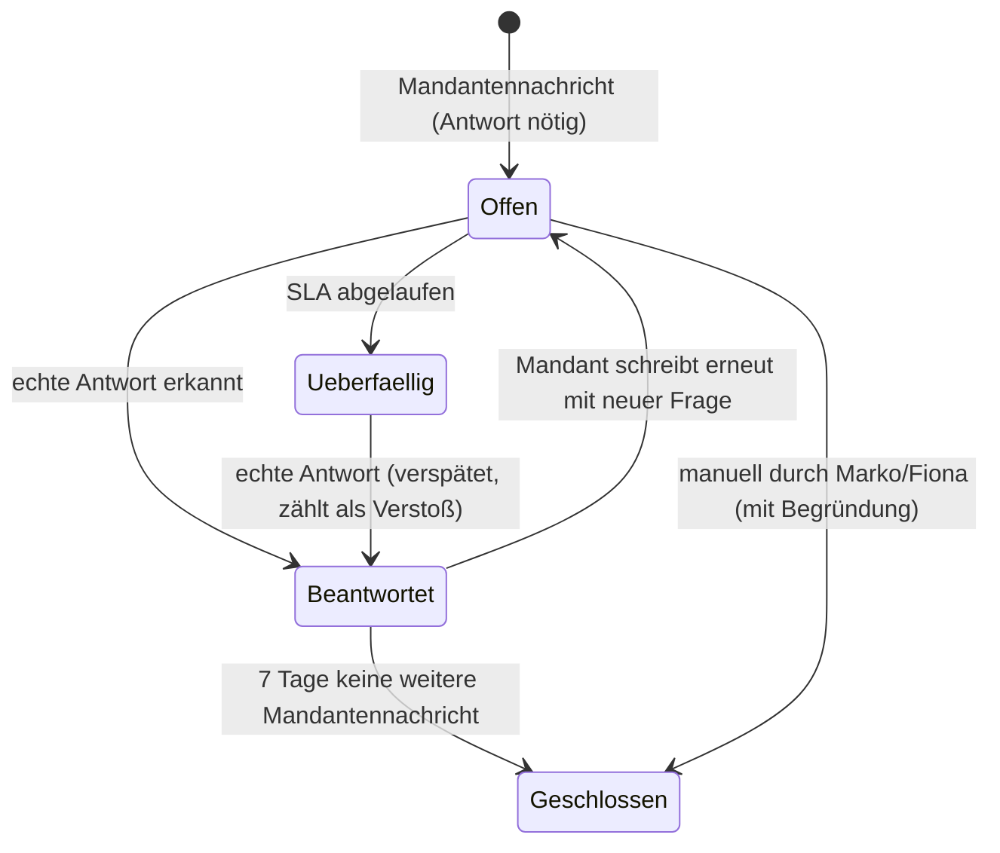
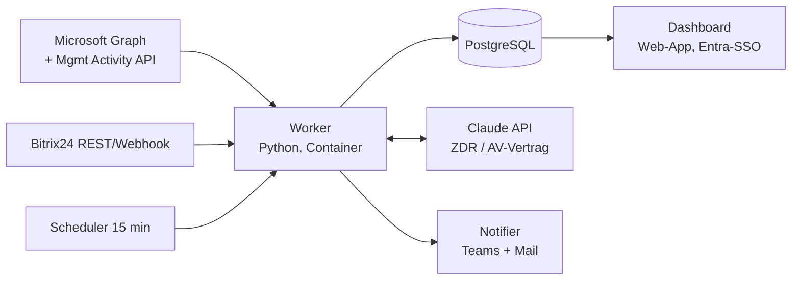

# Inbox-SLA-Monitor – Projektplan

**Ziel:** Jede Mandantenanfrage (E-Mail an die Sammelpostfächer und Mandanten-Nachrichten in Bitrix-Projekten) wird erfasst, einem Mitarbeiter zugeordnet und innerhalb von 24 Stunden **nachweislich** beantwortet. Ist das nicht der Fall, wird automatisch eskaliert. Marko und Fiona sehen alles in einem Dashboard, ohne die einzelnen Postfächer öffnen zu müssen.

Stand: 08.10.2026 · Status: Entscheidungen eingearbeitet, bereit für Phase 0

---

## 0. Befunde aus der Stichprobe (08.10.2026)

Vor dem Plan steht ein kurzer Blick in die echten Postfächer, weil er das Design bestimmt:

| # | Befund | Konsequenz für das Design |
|---|--------|---------------------------|
| 1 | **Das bestehende Triage-System meldet „erledigt“, ohne dass eine echte Antwort sichtbar ist.** Beispiel: eine Pfändungs-Meldung eines Mandanten (06.10., 06:01 Uhr) → Auto-Eingangsbestätigung um 06:01 → zwei Minuten später, um 06:03, die Meldung *„has been reviewed and addressed by our team“*. In welcome@ und filing@ ist keine inhaltliche Antwort zu finden. Dasselbe Muster zeigt eine einfache Kontaktanfrage (01.10.): erledigt nach zwei Minuten. | Ein Status, den Mitarbeiter selbst setzen, wird **nie** als Erledigung gewertet. Erledigt ist eine Anfrage erst, wenn eine inhaltliche Antwort beim Mandanten angekommen ist. Das prüft das System selbst. Das ist vermutlich der Hauptgrund, warum die bisherigen Ticketsysteme gescheitert sind. |
| 2 | Mandanten schreiben gleichzeitig an mehrere Adressen, im Beispiel an fünf Adressen: marko@, hello@, filing@, compliance@ und helphub@. | Deduplizierung über `internetMessageId` und Konversation. Sonst taucht eine Anfrage fünfmal auf. |
| 3 | Es gibt weitere Eingangsadressen: compliance@, helphub@, onboarding@. | Entschieden: Alle drei werden mit überwacht. |
| 4 | Mitarbeiter antworten teils **als** filing@ (erkennbar nur an der Signatur), teils aus dem persönlichen Postfach. | Wer geantwortet hat, steht nicht im Absender. Das muss über das Exchange-Audit-Log (SendAs) und die Gesendeten Elemente der Mitarbeiter ermittelt werden (siehe 3.3). |
| 5 | Viel Rauschen: Recruiter, Newsletter, Bitrix-Systemmails. | Für eine KI-Klassifizierung „Mandant ja/nein“ und „Antwort nötig ja/nein“ muss das System mitlesen. |
| 6 | Aktuelle Beschwerden bestätigen das Problem: allein am 08.10. drei Mandanten mit „nicht erreichbar“, „seit Monaten keine Updates“ und einer Nachfrage nach einer Woche. | Für den ersten Monat Baseline-Messung einplanen, damit der Erfolg belegbar ist. |
| 7 | hello@ ist für Marko per Delegation nicht lesbar. Mails an hello@ landen aber in welcome@. | Klären, ob hello@ ein Alias von welcome@ ist. |

---

## 1. Kritische Punkte vorab (bevor gebaut wird)

1. **Bombardieren allein verändert kein Verhalten.** Wer 30 Teams-Pings am Tag bekommt, schaltet den Bot stumm. Wirksam sind **sichtbare Konsequenzen**: Die Eskalation geht ab Stufe 2 an Fiona. Ab Stufe 3 wird die Anfrage umverteilt, und das landet in der Mitarbeiter-Statistik. Pro Mitarbeiter gibt es höchstens **eine gebündelte Erinnerung pro Stufe**, nicht eine pro Mail.
2. **Überlastung und Unwillen unterscheiden.** Das Dashboard muss die offene Last pro Kopf zeigen. Wenn eine Person 60 offene Fälle hat, ist das ein Kapazitätsproblem, und mehr Druck löst es nicht.
3. **Arbeitsrecht und Datenschutz.** Es gibt keinen Betriebsrat und keine Mitarbeiter in Deutschland. Die DSGVO gilt trotzdem, weil die GmbH Verantwortliche ist. Nötig sind eine Information der Mitarbeiter, ein Eintrag im Verarbeitungsverzeichnis und eine kurze DSFA (Details in Abschnitt 6). Die Mitarbeiter sollten offen informiert werden, denn die Transparenz ist ohnehin Teil des Hebels.
4. **Berufsgeheimnis (§ 203 StGB, § 62a StBerG).** Mandantenmails an ein LLM zu geben, braucht einen AV-Vertrag und eine Verschwiegenheitsverpflichtung des Dienstleisters, eine EU-Datenverarbeitung bzw. Zero-Data-Retention und eine Dokumentation. Das ist lösbar, muss aber **vor** Phase 1 stehen.
5. **KI-Autoantworten im Namen einer Steuerberatungsgesellschaft sind ein Haftungsthema.** Daher kommen sie erst in Phase 5, zunächst nur als Entwurf, und automatisch nur für eine enge Whitelist (siehe 3.6). Pfändungen, Finanzamt-Schreiben, Fristen und Beschwerden werden **nie** automatisch beantwortet.
6. **SLA (entschieden):** 1 Werktag (Mo–Fr, Feiertage NRW). P1-Fälle (Pfändung, Finanzamt, Frist ≤ 3 Tage, Kontosperre, Beschwerde) bekommen 4 Arbeitsstunden. Arbeitszeit für die Berechnung: 08:00–18:00 Uhr MEZ/MESZ.

---

## 2. Gesamtablauf

```mermaid
flowchart TD
    subgraph Quellen
        A1[filing@]:::src
        A2[gethelp@]:::src
        A3[hello@ / welcome@]:::src
        A4[compliance@, helphub@, onboarding@]:::src
        B1[Bitrix24 Projekte + CRM-Account-Timeline]:::src
    end

    A1 & A2 & A3 & A4 -->|Graph Change Notifications + Delta Sync| C[Ingest]
    B1 -->|Bitrix Outbound Webhook / REST Polling| C

    C --> D[Deduplizieren<br/>internetMessageId, conversationId, SNG-Referenz]
    D --> E{KI-Klassifizierung}
    E -->|Spam, Newsletter, Recruiter, System| X[Ignorieren, aber protokolliert]
    E -->|Mandant, keine Antwort nötig<br/>z. B. „Danke“| Y[Info, kein SLA]
    E -->|Mandant, Antwort nötig| F[Fall anlegen / Fall wieder öffnen<br/>Priorität P1/P2, SLA-Uhr startet]

    F --> G{Zuständigkeit aus Bitrix<br/>Mandant → Projekt → Verantwortlicher}
    G -->|Owner gefunden| H[Owner zuweisen]
    G -->|kein Owner| I[Queue „Unzugeordnet“]
    I --> I2{Einfache Anfrage?<br/>Whitelist}
    I2 -->|ja, ab Phase 5| AI[KI-Agent: Entwurf / Auto-Antwort]
    I2 -->|nein| J[Fiona weist zu]

    H --> K[(Fall-Datenbank)]
    J --> K
    AI --> K

    subgraph Antwort-Erkennung
        R1[Gesendete Elemente der Sammelpostfächer]
        R2[Gesendete Elemente der Mitarbeiter]
        R3[Exchange Audit-Log: SendAs = wer]
        R4[Bitrix: Antwort eines Mitarbeiters im Projekt]
    end
    R1 & R2 & R3 & R4 --> L{Echte Antwort?<br/>nicht Auto-Ack, nicht „addressed“-Template,<br/>KI-Prüfung: geht auf die Frage ein}
    L -->|ja| M[SLA-Uhr stoppt<br/>Antwortzeit + Mitarbeiter gespeichert]
    L -->|Pseudo-Antwort| N[Markiert als „Scheinerledigung“<br/>Uhr läuft weiter]
    M --> K
    N --> K

    K --> S[SLA-Scheduler alle 15 min]
    S --> T{Restzeit}
    T -->|"< 25 %"| T1[Stufe 1: Teams-DM an Owner, gebündelt]
    T -->|überschritten| T2[Stufe 2: Teams + E-Mail an Owner + Fiona]
    T -->|"+ 1 Werktag"| T3[Stufe 3: Fiona/Marko, Umverteilung vorgeschlagen]
    T -->|"+ 2 Werktage oder P1 überschritten"| T4[Stufe 4: Marko übernimmt / Krisen-Liste]

    K --> DB[Dashboard Marko & Fiona]
    K --> DG[Tagesreport 08:00 per Mail / Teams]

    classDef src fill:#eef,stroke:#88a
```

### Lebenszyklus eines Falls



**Regel für „normale Fälle“:** Antwortet ein Mitarbeiter inhaltlich innerhalb des SLA, entsteht **keine** Eskalation. Der Fall erscheint dann nur in der Statistik. Das deckt Ihre Anforderung ab, dass erledigte Fälle nicht bei Ihnen landen.

---

## 3. Bausteine im Detail

### 3.1 Datenquellen

| Quelle | Zugriff | Hinweis |
|--------|---------|---------|
| Sammelpostfächer | Microsoft Graph, **Application**-Berechtigung `Mail.Read`, per *RBAC for Applications* in Exchange Online auf genau diese Postfächer und die Mitarbeiterpostfächer begrenzt | Echtzeit über Change Notifications, dazu stündlich ein Delta-Sync als Netz für verlorene Events |
| Gesendete Elemente der Mitarbeiter | dito, nur der Ordner `SentItems` wird gelesen | erfasst Antworten aus persönlichen Postfächern ohne CC |
| Wer hat als filing@ gesendet? | Office 365 Management Activity API (`Audit.Exchange`, Operation `SendAs` / `SendOnBehalf`) | Mailbox-Auditing für die Sammelpostfächer muss aktiv sein. Fallback: Signatur-Erkennung |
| Bitrix24 | REST über Inbound-Webhook (`sonet_group.get`, `im.dialog.messages.get` mit `sgXXX`, `task.commentitem.getlist`), dazu Outbound-Webhook für neue Nachrichten | REST ist nur in kommerziellen Tarifen verfügbar. Mandanten posten in **Projekten** (Hauptfall) und in den **Account-Details** (CRM-Timeline). Details in Abschnitt 6 |
| Zuständigkeit | Bitrix: Firma/Kontakt im CRM → Projekt → `OWNER_ID` bzw. verantwortlicher Mitarbeiter | Zuordnung Mandant ↔ Absenderdomain/E-Mail muss gepflegt sein. Das Dashboard zeigt Lücken an |

### 3.2 Fall-Bildung (das schwierigste Stück)

- **Ein Fall = eine Mandanten-Konversation.** Sie wird verknüpft über `conversationId`, `In-Reply-To`/`References`, die bestehende **SNG-Referenz** und notfalls über den normalisierten Betreff und die Mandantendomain.
- Dieselbe Mail in drei Postfächern ergibt **einen** Fall (über `internetMessageId`).
- Die **SLA-Uhr startet** bei der ersten unbeantworteten Mandantennachricht. Weitere Nachfragen vor der Antwort setzen sie nicht zurück, erhöhen aber einen Zähler „Mandant hat nachgehakt“. Das ist ein starkes Beschwerde-Signal.
- Die **SLA-Uhr stoppt** bei einer ausgehenden Nachricht an den Mandanten, die
  - nicht von der Auto-Bestätigung bzw. dem „reviewed and addressed“-Template stammt,
  - keine reine interne Weiterleitung ist,
  - von der KI als *inhaltlich* eingestuft wird. Ein „Wir kümmern uns“ zählt als **Zwischenantwort**: Die Uhr stoppt, aber der Fall bleibt mit einer Folgefrist von 3 Werktagen offen.

### 3.3 Wer hat was gemacht?

Pro Fall werden folgende Zeitpunkte und Personen gespeichert:

- **Gelesen:** nur als Hinweis. Bei Sammelpostfächern ist „gelesen“ nicht personenbezogen und daher wenig aussagekräftig.
- **Zugewiesen:** Zeitpunkt und Person.
- **Erste echte Antwort:** Zeitpunkt, Person und Kanal (filing@ via SendAs, persönliches Postfach, Bitrix).
- **Scheinerledigungen:** wer das „addressed“-Template ohne inhaltliche Antwort ausgelöst hat. Der alte Ticket-Agent wird abgeschaltet (Phase 0). Seine Templates werden dauerhaft als „keine echte Antwort“ gefiltert.

### 3.4 KI-Klassifizierung (Claude)

Für jede eingehende Nachricht liefert die KI ein strukturiertes Ergebnis:

```json
{
  "is_client": true,
  "needs_reply": true,
  "priority": "P1",
  "category": "pfaendung|finanzamt|frist|dokumente|status|onboarding|rechnung|beschwerde|allgemein",
  "language": "en",
  "summary_de": "Mandant meldet Kontosperre wegen Pfändung, Zahlung erfolgt, bittet um Klärung mit Finanzamt",
  "simple_faq_candidate": false
}
```

- Ein günstiges Modell übernimmt die Klassifizierung, ein stärkeres Modell Antwortprüfung und Entwürfe.
- Alle KI-Entscheidungen lassen sich im Dashboard korrigieren, z. B. „war doch Spam“. Die Korrekturen fließen in die Regeln ein.
- Harte Regeln haben Vorrang vor der KI: bekannte Mandantendomains gelten immer als Mandant, Absender auf der Blacklist immer als Rauschen.

### 3.5 Eskalationsleiter (Vorschlag)

| Stufe | Zeitpunkt (P2 = 1 Werktag) | Zeitpunkt (P1 = 4 Arbeitsstunden) | Kanal | Empfänger |
|-------|----------------|-----------------|-------|-----------|
| 0 | Eingang | Eingang | Teams-DM (gebündelt) | Owner: „Neuer Fall“ |
| 1 | 75 % der Frist | 50 % der Frist | Teams-DM, dazu Teams-Aktivität | Owner |
| 2 | Frist überschritten | Frist überschritten | Teams + E-Mail | Owner, dazu Fiona (gebündelt 10:00 und 15:00 Uhr, P1 sofort) |
| 3 | +1 Werktag | +2 h | Teams + E-Mail + Dashboard rot | Fiona und Marko (Umverteilung mit einem Klick) |
| 4 | +2 Werktage | +4 h | E-Mail + Teams | Marko, Fall erscheint auf der „Chef übernimmt“-Liste. Der Owner wird in der Scorecard markiert |

Dazu kommen:

- **Tägliche Sammel-Mail um 08:00 Uhr** an jeden Mitarbeiter mit seinen offenen Fällen und Restzeiten.
- **Wöchentliches Scorecard-Mail** an Marko und Fiona: pro Mitarbeiter Medianzeit, SLA-Quote, Verstöße und Scheinerledigungen.
- **Abwesenheiten:** Ist ein Owner im Urlaub (Outlook-Abwesenheit oder Bitrix-Abwesenheit), geht der Fall sofort an die Vertretung bzw. in „Unzugeordnet“. Sonst eskaliert das System Leute, die gar nicht da sind.

### 3.6 KI-Agent für unzugeordnete einfache Anfragen (Phase 5)

| Darf automatisch (nach Freigabe-Pilot) | Nur als Entwurf zur Freigabe | Niemals KI |
|------------------------------------------|------------------------------|------------|
| Kontaktdaten und Ansprechpartner | Statusfragen („Wurde Q3 eingereicht?“), wenn der Status in Bitrix eindeutig ist | Pfändung, Kontosperre, Finanzamt-Schreiben |
| Bestätigung, dass Dokumente eingegangen sind | Rückfragen zu Unterlagen | Beschwerden, Kündigungen |
| Allgemeine Prozess-FAQ (Fristen-Kalender, Upload-Weg) | Neukunden-Anfragen (Weiterleitung an Vertrieb) | Steuerliche Beratung, Zahlbeträge |

Ablauf: Die KI erstellt einen Entwurf im Sammelpostfach, und ein Mensch gibt ihn mit einem Klick im Dashboard frei. Erst nach etwa 4 Wochen mit über 95 % unveränderten Freigaben wird die erste Kategorie auf Auto-Versand umgestellt.

### 3.7 Dashboard (Marko & Fiona)

Login per Microsoft-SSO (Entra ID), nur für freigegebene Personen. Ansichten:

1. **Jetzt handeln:** offene Fälle, sortiert nach Restzeit (rot/gelb/grün), mit Mandant, Betreff, KI-Zusammenfassung, Owner, Anzahl Nachfragen und Link direkt in Outlook bzw. Bitrix. Buttons für „Neu zuweisen“, „Ich übernehme“ und „Kein SLA (Begründung)“.
2. **Eskalationen:** Stufe 3 und 4 sowie Scheinerledigungen.
3. **Mitarbeiter-Scorecard:** pro Person offene Fälle, Median der Erstantwort, SLA-Quote über 7 und 30 Tage, Verstöße, Scheinerledigungen, aktuelle Last.
4. **Mandant:** komplette Kommunikationshistorie über alle Postfächer und Bitrix in einer Zeitleiste.
5. **Postfächer:** Volumen pro Postfach und Tag, Anteil Rauschen, Anteil ohne Owner.
6. **Datenqualität:** Mandanten ohne Bitrix-Zuordnung und unbekannte Absenderdomains.

---

## 4. Architektur (Empfehlung)



- **Hosting:** Azure (Region Germany West Central oder EU). Die Daten verlassen den M365-Kontext nur Richtung LLM, und dafür gibt es den Vertrag.
- **Teams-Benachrichtigungen:** Teams Workflows (Power Automate) per Webhook oder ein schlanker Bot. Der Webhook ist schneller umgesetzt, der Bot kann persönliche DMs schicken.
- **Warum keine Standardsoftware** wie EmailAnalytics, timetoreply oder Emailgistics? Diese Tools messen Antwortzeiten in Outlook-Postfächern gut und sind schneller eingeführt. Sie kennen aber weder Bitrix noch Ihre Zuständigkeiten, und sie erkennen keine Scheinerledigungen. **Empfehlung:** für die Baseline-Messung in Phase 1 ernsthaft gegen die Eigenentwicklung abwägen, insbesondere wenn die Bitrix-Anbindung sich als schwierig erweist.

---

## 5. Projektphasen

| Phase | Inhalt | Ergebnis | Dauer (grob) |
|-------|--------|----------|--------------|
| **0 – Klärung** | Alten Ticket-Agenten finden, abschalten und das verifizieren. App-Registrierung in Entra, RBAC for Apps (7 Postfächer und die Sent Items der Mitarbeiter), Mailbox-Auditing aktivieren, AV-Vertrag LLM, Mitarbeiter-Info, DSFA | Freigaben und Zugänge | 1–2 Wochen |
| **1 – Schattenbetrieb** | Ingest aller Postfächer, Fall-Bildung, Antwort-Erkennung, KI-Klassifizierung. **Keine Eskalation**, nur Messung, 30 Tage rückwirkend | Baseline: wie schlecht ist es wirklich, pro Mitarbeiter. Erkennungsgenauigkeit stichprobenartig geprüft (Ziel ≥ 95 %) | 2 Wochen |
| **2 – Dashboard** | Ansichten 1–6, SSO, Tagesreport | Marko und Fiona arbeiten nur noch im Dashboard | 1–2 Wochen |
| **3 – Eskalation** | Leiter aus 3.5, Abwesenheitslogik, gebündelte Benachrichtigungen. Start mit Stufe 2–4, Stufe 0–1 nach einer Woche | Automatischer Druck mit Konsequenzen | 1 Woche + 2 Wochen Feinjustierung |
| **4 – Bitrix** | 4a: Projekte (Chat, Feed, Aufgaben-Kommentare). 4b: CRM-Timeline der Account-Details. Zuständigkeiten aus Bitrix CRM und Projekten | Vollständiges Bild über beide Kanäle | 1–2 Wochen (abhängig von der Bitrix-Struktur) |
| **5 – KI-Agent** | Entwürfe für unzugeordnete Anfragen, Freigabe per Klick, später Auto-Versand für die Whitelist | Entlastung bei einfachen Anfragen | 2 Wochen + 4 Wochen Pilot |

**Bewusste Reihenfolge:** Erst messen, dann eskalieren. Fehlalarme in Woche 1 kosten sofort die Akzeptanz, und die Mitarbeiter hätten dann ein berechtigtes Argument gegen das System. Bitrix kommt bewusst nach den E-Mails, weil das Beschwerdevolumen erkennbar per Mail läuft. Ist Bitrix bei Ihnen gleich wichtig, lässt sich Phase 4 vorziehen.

---

## 6. Entscheidungen (Stand 08.10.2026)

| # | Thema | Entscheidung |
|---|-------|--------------|
| 1 | SLA | **1 Werktag** (Mo–Fr, Feiertage NRW, Kanzleisitz). **P1 = 4 Arbeitsstunden.** Keine 24 h Kalenderzeit. |
| 2 | Postfächer | filing@, gethelp@, hello@/welcome@ **plus** compliance@, helphub@, onboarding@ |
| 3 | Bitrix | Mandanten posten unkontrolliert in **Projekten** (Hauptfall) oder in den **Account-Details** (CRM-Timeline). Beide Quellen werden angebunden, Projekte zuerst. |
| 4 | Ticket-Agent (SNG-Referenzen) | Laut Marko abgeschaltet. **Widerspricht den Postfächern:** Am 06.10. und am 08.10. (16:28 und 16:44 Uhr, filing@) wurden noch SNG-Bestätigungen und „reviewed and addressed“-Mails versendet. Muss in Phase 0 nachweislich abgeschaltet werden (siehe unten). |
| 5 | Betriebsrat | Keiner. Keine Mitarbeiter in Deutschland, § 87 BetrVG entfällt. |
| 6 | Repo | Plan darf ins Repo. |

| 7 | Eskalationsempfänger | **Fiona und Marko.** Es gibt keine Teamleitungsebene. |
| 8 | Umsetzung | **Eigenentwicklung** |
| 9 | Bitrix-Tarif | **Enterprise.** REST, Webhooks und Extranet sind verfügbar. |
| 10 | M365-Admin | Marko richtet App-Registrierung und Exchange-Rechte selbst ein, nach der Anleitung in `PHASE0_SETUP.md`. |

**Weiterhin offen:** Ist hello@ ein Alias von welcome@? Das klärt sich beim Einrichten (`Get-Recipient hello@singularity.tax`).

**Konsequenz aus Entscheidung 7:** Ohne Teamleitung landen ab Stufe 2 alle Eskalationen direkt bei Fiona und Marko. Damit werden die beiden zum Engpass. Bei schlechter Ausgangslage sind 20 bis 40 Eskalationen pro Tag realistisch. Deshalb:

- **Stufe 2 geht nur an Fiona, gebündelt zweimal täglich (10:00 und 15:00 Uhr).** Einzelmeldungen gibt es nur für P1.
- **Stufe 3 geht an Fiona und Marko.** Marko bekommt nur, was Fiona nicht innerhalb eines halben Werktags umverteilt hat, und alle P1-Verstöße.
- **Vertretung:** Ist Fiona abwesend (Outlook-Abwesenheit), geht Stufe 2 an Marko, und umgekehrt.

### Konsequenzen aus den Entscheidungen

**Ticket-Agent.** Solange der alte Agent noch „reviewed and addressed“ verschickt, erhalten Mandanten falsche Erledigungsmeldungen. Außerdem stoppt die Uhr, wenn man den Absender nicht ausfiltert. Phase 0 enthält deshalb drei Schritte:

1. Den Agenten finden und abschalten. Infrage kommen ein Power-Automate-Flow, eine Logic App, eine Postfachregel oder ein externes Tool mit Graph-Zugriff. Prüfen lässt sich das über die Enterprise Apps in Entra und über die Flows der Sammelpostfächer.
2. Danach 48 Stunden lang prüfen, dass keine SNG-Mails mehr rausgehen.
3. Seine Templates bleiben im Monitor als „nie eine echte Antwort“ hinterlegt, damit Altlasten nicht zählen.

**Bitrix.** Weil Mandanten an zwei Stellen posten, liest der Monitor beide:

- **Projekte (Phase 4a):** Projekt-Chat (`im.dialog.messages.get` mit `sgXXX`), Live-Feed des Projekts (`log.blogpost.get` mit Gruppenfilter) und Aufgaben-Kommentare im Projekt. Mandant = Extranet- bzw. Gastnutzer im Projekt. Antwort = Beitrag eines internen Mitarbeiters danach im selben Strang.
- **Account-Details (Phase 4b):** CRM-Timeline von Firma und Kontakt (`crm.timeline.comment.list`, Aktivitäten). Hier muss erkennbar sein, ob ein Eintrag vom Mandanten stammt. Wenn Mandanten dort technisch gar nicht selbst schreiben können, sondern nur Mitarbeiter, entfällt 4b. Das klären wir am echten Portal.

**Datenschutz ohne deutsche Mitarbeiter.** Der Betriebsrat entfällt, die DSGVO nicht. Die Singularity GmbH ist Verantwortliche, die Verarbeitung der Mitarbeiterdaten fällt also unter die DSGVO, und es gilt zusätzlich das Arbeitsrecht des Landes, in dem die Mitarbeiter beschäftigt sind. Minimal nötig sind:

- eine schriftliche Information der Mitarbeiter bzw. der Dienstleister,
- ein Eintrag im Verarbeitungsverzeichnis,
- eine kurze DSFA.

Unabhängig davon bleibt der AV-Vertrag für das LLM wegen § 203 StGB Pflicht.

## 7. Erfolgskriterien

- ≥ 95 % der Mandantenanfragen erhalten innerhalb des SLA eine echte Antwort (Baseline aus Phase 1).
- 0 Fälle über 3 Werktage ohne Antwort.
- 0 unentdeckte Scheinerledigungen.
- Mandanten-Nachhaken („any update?“) halbiert sich innerhalb von 8 Wochen.
- Marko und Fiona öffnen kein Sammelpostfach mehr für die Kontrolle.
